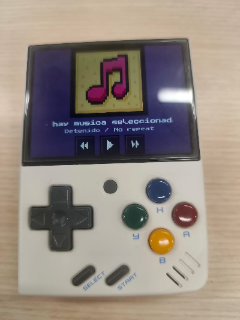
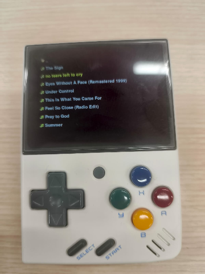
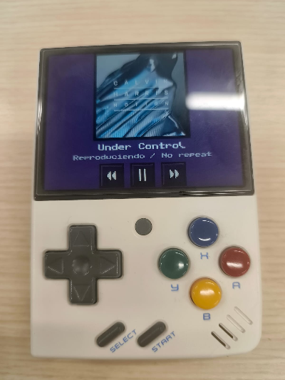

# miyoo-mini-mp3-player
Lightweight MP3 background music player for Miyoo Mini V3. Designed for low-resource environments with direct SDL/audio output and minimal system overhead.
This app only works in Onion OS.


# Instructions

Copy your music files to the SD card folder:
Media/Music/

Extract the ZIP file into the App directory.






# Music Player - Developer Instructions

## 1. Update apt
```sh
apt update
```

## 2. Install dependencies
```sh
apt install -y libsdl-image1.2-dev libsdl-mixer1.2-dev libsdl-ttf2.0-dev libsdl-gfx1.2-dev curl 
apt install -y pulseaudio alsa-utils
```


## 3. Install python/2.7.18/
```sh
sudo apt install -y build-essential checkinstall libncurses-dev libssl-dev libsqlite3-dev tk-dev libgdbm-dev libc6-dev libbz2-dev libffi-dev libreadline-dev libdb-dev
cd /usr/src
wget https://www.python.org/ftp/python/2.7.18/Python-2.7.18.tgz
tar xzf Python-2.7.18.tgz
cd Python-2.7.18
```

## 4. Install pip and libs
```sh
curl https://bootstrap.pypa.io/pip/2.7/get-pip.py -o get-pip.py
python2 get-pip.py
pip2 install pygame==1.9.6
pip2 install mutagen
pip2 install Pillow
```

## 4. execute
```sh
python2 src/main.py 
```
